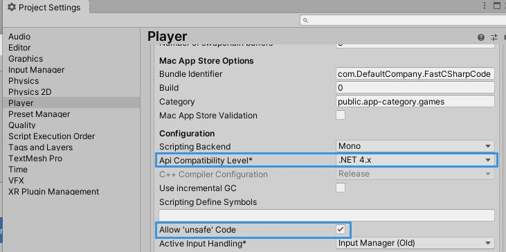
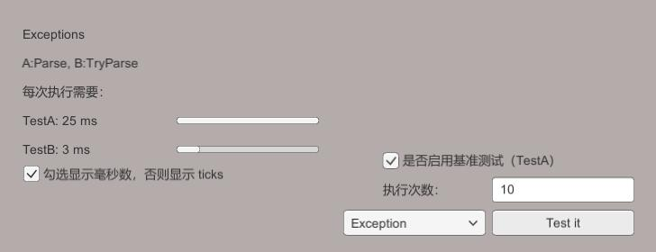

# Unity C# 代码性能测试

## 环境
* Unity 2019.3.0f5 （代码其实跟版本没啥关系）
* api compatibility level：.net 4.x
* enable unsafe code



## 介绍

测试下 C# 代码在不同写法下的性能差异。

例如处理 `int.Parse` 的异常：

```c#
public new const int DefaultRepetitions = 10;
public const int ListSize = 1000;

protected override bool MeasureTestA()
{
    for (int i = 0; i < Iterations; i++)
    {
        for (int j = 0; j < ListSize; j++)
        {
            try
            {
                int.Parse(numbers[j]);
            }
            catch (FormatException)
            {
            }
        }
    }

    return true;
}

protected override bool MeasureTestB()
{
    for (int i = 0; i < Iterations; i++)
    {
        for (int j = 0; j < ListSize; j++)
        {
            var success = int.TryParse(numbers[j], out int number);
        }
    }

    return true;
}
```



## 参考
* [How to Write Very Fast C# Code](https://www.youtube.com/watch?v=-H5oEgOdO6U)
* [《.Net 性能优化》](https://book.douban.com/subject/30318284/)